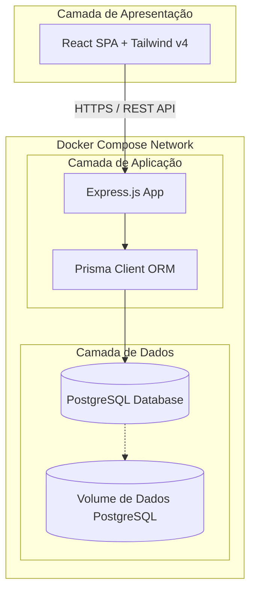
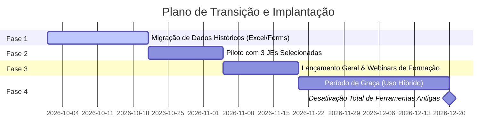

# Proposta Técnica: Plataforma Unificada JE Portugal (Mandato 2026/2027)

Esta proposta apresenta a arquitetura técnica, modelação de base de dados e estratégia de transição para a nova plataforma de centralização do Movimento Júnior Português (MJP), visando eliminar a fragmentação de dados (Google Forms, Excel, e-mails) e estabelecer um ecossistema seguro, escalável e centrado na experiência do utilizador.

---

## 1. Stack Tecnológica & Justificação

A stack proposta foi desenhada para garantir máxima performance, facilidade de manutenção por futuras equipas de IT da Federação e facilidade de desenvolvimento local através de Docker.

| Tecnologia | Função | Justificação |
| :--- | :--- | :--- |
| **React (Vite)** | Frontend SPA | Rápido tempo de carregamento, ecossistema rico e excelente DX (Developer Experience) com HMR (Hot Module Replacement). |
| **Tailwind CSS v4** | Estilização | Estilização moderna e rápida usando variáveis CSS nativas, reduzindo o tamanho do bundle final e facilitando a consistência visual (UI/UX). |
| **Node.js (Express)** | Backend API | Modelo não-bloqueante (I/O assíncrono), ideal para lidar com múltiplas requisições simultâneas de submissões de formulários. Comunidade ativa e curva de aprendizagem reduzida. |
| **Prisma ORM** | Acesso ao Banco | Abstração segura contra injeções SQL, tipagem estática (Type Safe), e migrações estruturadas do banco de dados (Prisma Migrate). |
| **PostgreSQL** | Base de Dados | Banco relacional robusto, com suporte nativo a dados estruturados e semiestruturados (JSONB para auditorias flexíveis) e conformidade ACID rígida para dados confidenciais. |
| **Docker & Compose** | Infraestrutura | Padronização dos ambientes de desenvolvimento, staging e produção. Facilita o onboarding de novos desenvolvedores de IT da Federação. |

---

## 2. Diagrama de Arquitetura do Sistema

A arquitetura adota o modelo **Client-Server (Monólito Modular)**, que é o mais adequado para o contexto do MJP, pois reduz a complexidade operacional de microsserviços enquanto garante a separação de responsabilidades.



### Segurança na Arquitetura:
- **HTTPS Enforced**: Todo o tráfego entre o cliente e o servidor será criptografado.
- **CORS Configurado**: Apenas o domínio do frontend terá autorização para fazer chamadas à API.
- **Isolamento de Banco**: O banco PostgreSQL não fica exposto para a internet; apenas o container do Express consegue comunicar com ele dentro da rede interna do Docker.

---

## 3. Estrutura da Base de Dados (Modelação Prisma)

Abaixo está o modelo de base de dados representado em sintaxe Prisma (`schema.prisma`), cobrindo os 7 módulos prioritários.

```prisma
datasource db {
  provider = "postgresql"
  url      = env("DATABASE_URL")
}

generator client {
  provider = "prisma-client-js"
}

// ----------------------------------------------------
// MÓDULO 7: Objetivos e Gestão (Entidades Principais)
// ----------------------------------------------------

enum Role {
  FEDERATION_ADMIN   // IT Manager, Direção JE Portugal
  AUDITOR            // Equipa de Auditoria
  JE_PRESIDENT       // Presidente de uma Júnior Empresa
  JE_MEMBER          // Membro de uma Júnior Empresa
}

enum OrgStatus {
  JUNIOR_INITIATIVE  // Júnior Iniciativa
  JUNIOR_ENTERPRISE  // Júnior Empresa
}

model User {
  id             String             @id @default(uuid())
  email          String             @unique
  passwordHash   String
  name           String
  role           Role               @default(JE_MEMBER)
  organizationId String
  organization   Organization       @relation(fields: [organizationId], references: [id])
  
  // Relações
  reviewedCycles IndicatorCycle[]   @relation("ReviewerRelation")
  readReceipts   AnnouncementRead[]
  createdAt      DateTime           @default(now())
}

model Organization {
  id        String       @id @default(uuid())
  name      String       @unique
  status    OrgStatus    @default(JUNIOR_INITIATIVE)
  logoUrl   String?
  
  // Relações
  users           User[]
  indicatorCycles IndicatorCycle[]
  audits          Audit[]
  eventApps       EventApplication[]
  objectives      Objective[]
  createdAt       DateTime           @default(now())
}

// ----------------------------------------------------
// MÓDULO 1: Acompanhamento Semestral
// ----------------------------------------------------

enum CycleStatus {
  DRAFT
  SUBMITTED
  UNDER_REVIEW
  CLOSED
}

model IndicatorCycle {
  id             String          @id @default(uuid())
  semester       String          // Ex: "2026.1", "2026.2"
  status         CycleStatus     @default(DRAFT)
  notes          String?         // Notas de encerramento da reunião
  meetingDate    DateTime?
  organizationId String
  organization   Organization    @relation(fields: [organizationId], references: [id])
  reviewerId     String?
  reviewer       User?           @relation("ReviewerRelation", fields: [reviewerId], references: [id])
  
  indicators     Indicator[]
  updatedAt      DateTime        @updatedAt
}

model Indicator {
  id       String         @id @default(uuid())
  cycleId  String
  cycle    IndicatorCycle @relation(fields: [cycleId], references: [id], onDelete: Cascade)
  key      String         // Ex: "Faturamento", "NumeroMembros", "NPS"
  value    Float
}

// ----------------------------------------------------
// MÓDULO 2: Auditoria e Certificação
// ----------------------------------------------------

enum AuditStatus {
  SCHEDULED
  DOCUMENTS_SUBMITTED
  APPROVED
  REJECTED
}

model Audit {
  id             String          @id @default(uuid())
  year           Int
  status         AuditStatus     @default(SCHEDULED)
  score          Float?          // Pontuação ponderada calculada
  organizationId String
  organization   Organization    @relation(fields: [organizationId], references: [id])
  
  documents      AuditDocument[]
  updatedAt      DateTime        @updatedAt
}

model AuditDocument {
  id          String   @id @default(uuid())
  auditId     String
  audit       Audit    @relation(fields: [auditId], references: [id], onDelete: Cascade)
  name        String   // Nome do documento exigido (ex: "Estatutos")
  fileUrl     String?  // URL do ficheiro no Storage
  isApproved  Boolean? // null = pendente, true = aprovado, false = rejeitado
  feedback    String?
}

// ----------------------------------------------------
// MÓDULO 3: Censos Anuais
// ----------------------------------------------------

model Census {
  id        String   @id @default(uuid())
  year      Int
  data      Json     // Dados dinâmicos do censo (estrutura de membros, faturamento detalhado, etc.)
  submitted Boolean  @default(false)
  createdAt DateTime @default(now())
}

// ----------------------------------------------------
// MÓDULO 4: jeniAL (Candidaturas a Prémios)
// ----------------------------------------------------

model JeniALApplication {
  id           String   @id @default(uuid())
  category     String   // Ex: "Júnior Empresa do Ano", "Júnior Iniciativa Mais Promissora"
  documentUrl  String   // Proposta de candidatura
  videoUrl     String?  
  score        Float?
  feedback     String?
  submittedAt  DateTime @default(now())
}

// ----------------------------------------------------
// MÓDULO 5: Candidaturas a Eventos (Organização)
// ----------------------------------------------------

model EventApplication {
  id             String       @id @default(uuid())
  eventName      String       // Ex: "JENC 2027", "jeniAL 2026"
  concept        String       // Descrição da proposta de conceito
  logisticsUrl   String       // Ficheiro da proposta logística (PDF)
  budgetUrl      String       // Ficheiro do orçamento previsto (XLSX)
  isApproved     Boolean?
  organizationId String
  organization   Organization @relation(fields: [organizationId], references: [id])
  submittedAt    DateTime     @default(now())
}

// ----------------------------------------------------
// MÓDULO 6: Comunicação Oficial (Registo de Leitura)
// ----------------------------------------------------

model Announcement {
  id        String             @id @default(uuid())
  title     String
  content   String
  createdAt DateTime           @default(now())
  
  reads     AnnouncementRead[]
}

model AnnouncementRead {
  id             String       @id @default(uuid())
  announcementId String
  announcement   Announcement @relation(fields: [announcementId], references: [id], onDelete: Cascade)
  userId         String
  user           User         @relation(fields: [userId], references: [id], onDelete: Cascade)
  readAt         DateTime     @default(now())

  @@unique([announcementId, userId]) // Garante registo único por utilizador
}

// ----------------------------------------------------
// MÓDULO 7: Metas e Objetivos Organizacionais
// ----------------------------------------------------

model Objective {
  id             String       @id @default(uuid())
  title          String       // Ex: "Faturar 15.000€"
  targetValue    Float
  currentValue   Float        @default(0)
  year           Int
  organizationId String
  organization   Organization @relation(fields: [organizationId], references: [id])
}
```

---

## 4. Matriz de Permissões (RBAC)

A segurança dos dados é garantida através de **Role-Based Access Control (RBAC)** tanto nas rotas da API (backend) quanto na renderização de componentes (frontend).

| Módulo | FEDERATION_ADMIN | AUDITOR | JE_PRESIDENT | JE_MEMBER |
| :--- | :--- | :--- | :--- | :--- |
| **1. Acompanhamento** | Leitura/Escrita global | Leitura/Agendamento | Submete dados da sua JE | Apenas leitura da sua JE |
| **2. Auditoria** | Leitura global / Aprovação | Avalia e atribui score | Submete docs da sua JE | Sem Acesso |
| **3. Censos Anuais** | Define censo / Relatório | Leitura dos dados | Preenche e submete | Sem Acesso |
| **4. jeniAL** | Define categorias / Avalia | Sem Acesso | Submete candidaturas | Sem Acesso |
| **5. Candidaturas Evento**| Avalia propostas | Sem Acesso | Submete propostas | Sem Acesso |
| **6. Comunicação** | Publica comunicados | Leitura | Leitura (Registo Leitura) | Leitura (Registo Leitura) |
| **7. Objetivos & Metas** | Edita metas globais | Leitura | Edita metas da sua JE | Leitura das suas metas |

---

## 5. Funcionalidades da Plataforma (UX/UI & UX Estratégica)

A experiência do utilizador (UX) deve mitigar a burocracia típica das obrigações da federação:
1. **Dashboard Consolidado (UI/UX)**: Cada utilizador de uma Júnior Empresa terá um "Health Check" visual mostrando o status da Auditoria, o Censo pendente, as Metas do ano e as leituras de comunicados em atraso.
2. **Alertas Visuais**: Utilização de cores semafóricas (verde, amarelo, vermelho) no dashboard dos Administradores para identificar facilmente quais JEs estão em atraso no ciclo de Acompanhamento ou com documentação rejeitada na Auditoria.
3. **Formulários Interativos**: Salvaguarda automática (Auto-save) nos formulários longos dos Censos e Acompanhamento, evitando perda de dados por queda de ligação.

---

## 6. Plano de Transição para a Nova Plataforma

Substituir ferramentas consolidadas (Excel/Google Forms) requer uma estratégia suave para evitar atrito e resistência dos utilizadores das JEs.



### Detalhe das Fases:
- **Fase 1: Migração**: Desenvolver scripts em Node.js utilizando Prisma para estruturar dados históricos das folhas de cálculo do Excel dos mandatos anteriores diretamente nas tabelas `Objective`, `Census` e `Organization`.
- **Fase 2: Programa Piloto**: Lançamento beta para 3 JEs de perfis diferentes (uma grande, uma média e uma Júnior Iniciativa) para recolha de feedback de UX e deteção de bugs.
- **Fase 3: Formação**: Realização de sessões online síncronas com os presidentes e responsáveis de qualidade das JEs, além de documentação e manuais acessíveis na própria plataforma.
- **Fase 4: Período de Graça**: Permitir a utilização de ambos os métodos por 30 dias para evitar o bloqueio operacional em caso de bugs críticos iniciais, terminando com a desativação dos formulários antigos e exportação final.
